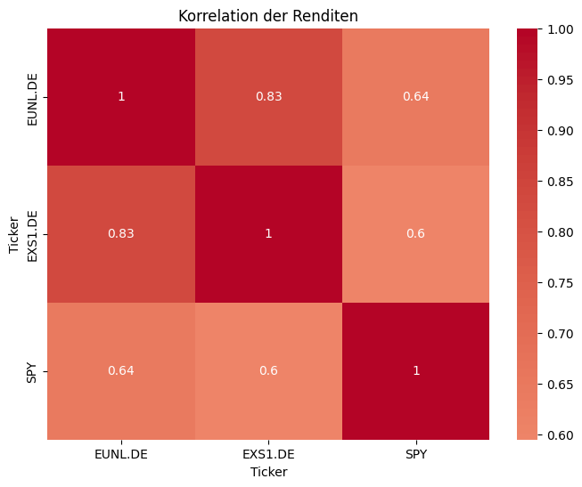

# 📈 ETF- & Portfolio-Analyse (2019-2024)
Dieses Projekt analysiert verschiedene Anlagen (S&P500,DAX, MSCI WORLD). 
Neben Einzel-ETF-Analysen wird auch ein Beispiel-Portfolio simuliert und bewertet. 

## Libraries
- pandas
- numpy
- matplotlib
- yfinance
- seaborn

## Ausführen (in Google Colab)
1. Notebook öffnen [Google Colab Link] (https://colab.research.google.com/drive/1CAORhY5R33hG03s5bJ2kNCJvqB4rlVWL?usp=sharing)
2. Libraries installieren ('!pip install yfinance pandas numpy matplotlib seaborn')

## Kennzahlen
- Annualisierte Renditen
- Volatilität
- Sharpe Ratio

## Visualisierung
- Kursentwicklung
- Heatmap der Korrelation
- Vergleich Portfolio vs. Benchmark

## Beispiel-Output

